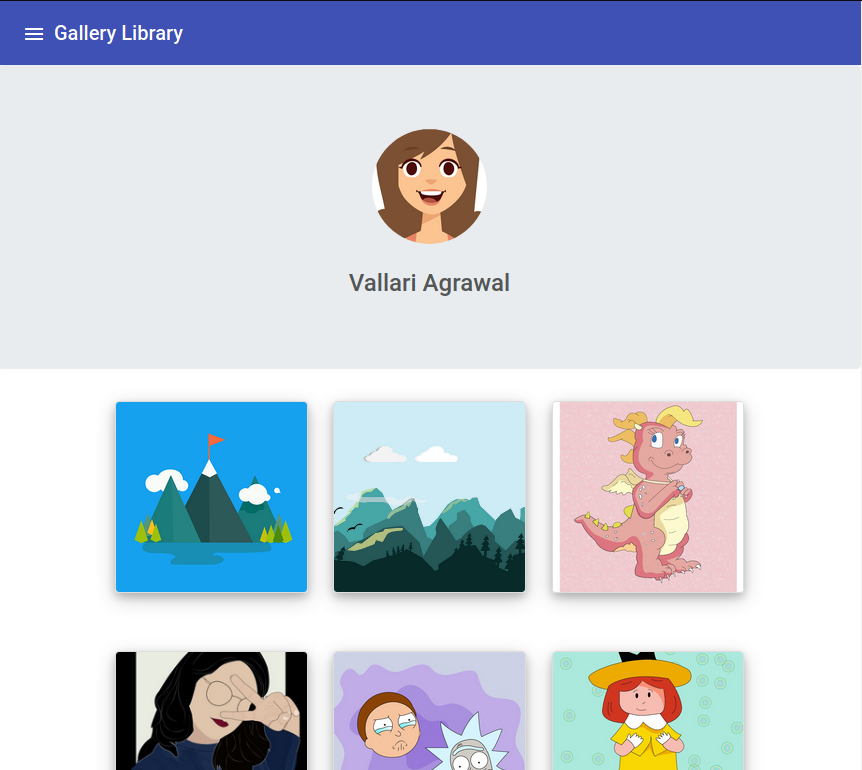

# Image-Gallery

A PWA to display your images in a gallery, made with Angular.



## Prerequisites

1. `npm` is distributed with Node.js- which means that when you download Node.js, you automatically get npm installed on your computer.

2. To install `nodejs`:

```
        sudo apt-get update
        sudo apt-get install nodejs

```

3. Install Angular CLI:

```
        npm install -g @angular/cli
```

## Installing

Install the npm packages described in the package.json and verify that it works:

```
    npm install
    npm start
```

The npm start command builds (compiles TypeScript and copies assets) the application into dist/, watches for changes to the source files, and runs live-server.

Shut it down manually with Ctrl-C.

## Built With

- HTML5
- CSS
- JavaScript
- Firebase (for web)

## Authors

- Vallari Agrawal - [VallariAg](github.com/vallariag)
